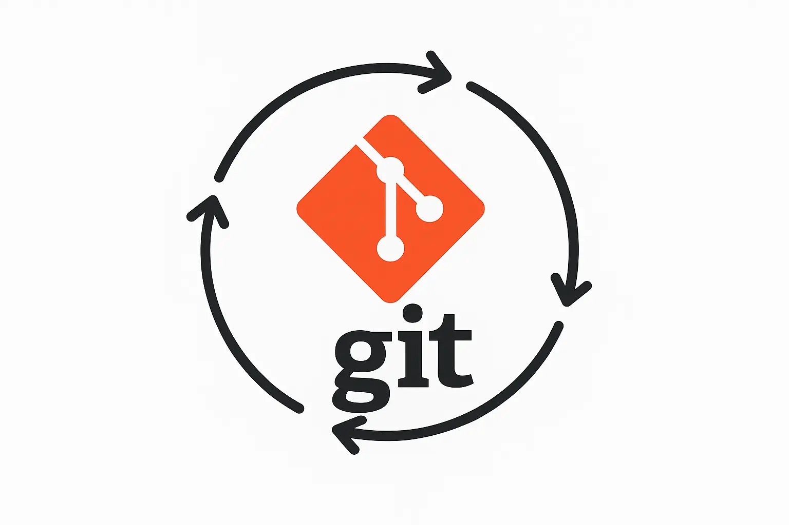

# The Genesis

Every developer knows the importance of a good Git workflow, but setting one up can be time-consuming and error-prone. That's why I created the Git Workflow Initializer - a set of scripts and configurations that automate the process of setting up a professional Git workflow for any project.

## The Problem

In my journey as a developer, I've seen (and been guilty of) inconsistent commit messages, manual version bumps, and forgotten changelog updates. These issues can lead to:

- Confusing commit histories
- Inconsistent versioning
- Time-consuming release processes
- Poor collaboration between team members

## The Solution

I built two complementary solutions to address different project needs:

### 1. Simple Workflow (`setup-git-simple.sh`)
Perfect for small to medium projects, this setup includes:
- ✅ **Commit Message Validation** with commitlint
- 🔄 **Automated Versioning** using semantic-release
- 📜 **Automatic CHANGELOG** generation
- 🐶 **Git Hooks** with Husky
- 🔒 **GitHub Releases** integration

### 2. Advanced Workflow (`setup-git-advanced.sh`)
For larger projects or teams needing more robust tooling, this adds:
- 🧪 **Automated Testing** integration
- 🔍 **Code Quality Checks** (ESLint, Prettier)
- 🔄 **CI/CD Pipeline** setup
- 🔒 **Security Scanning**
- 📦 **Docker Support**
- 🏗️ **Monorepo Support**

## Key Features in Depth

### 1. Commit Message Validation
Using commitlint with the conventional commits specification, we ensure every commit message follows a consistent format. This makes the commit history more readable and enables automated versioning.

### 2. Automated Versioning & Changelogs
By analyzing commit messages, the system can automatically determine the next version number (major, minor, or patch) and generate detailed changelogs. This eliminates human error in version management.

### 3. Git Hooks with Husky
Pre-commit and commit-msg hooks ensure code quality and commit message standards are maintained before changes are committed to the repository.

### 4. CI/CD Integration
The advanced workflow includes GitHub Actions configuration for automated testing and deployment, ensuring code quality and consistency across the team.

## Technical Implementation

The project leverages several powerful tools:

- **Husky**: For managing Git hooks
- **commitlint**: For commit message validation
- **semantic-release**: For automated versioning and changelog generation
- **release-it**: For release management
- **ESLint & Prettier**: For code quality and formatting
- **Docker**: For containerization support

## Getting Started

Setting up the workflow is straightforward:

```bash
# For simple workflow
curl -O https://raw.githubusercontent.com/arizmuajianisan/git-workflow-init/main/scripts/setup-git-simple.sh
chmod +x setup-git-simple.sh
./setup-git-simple.sh

# Or for advanced workflow
curl -O https://raw.githubusercontent.com/arizmuajianisan/git-workflow-init/main/scripts/setup-git-advanced.sh
chmod +x setup-git-advanced.sh
./setup-git-advanced.sh
```

## The Impact

Since implementing this workflow, I've noticed:
- More consistent commit messages
- Fewer versioning mistakes
- Automated changelog generation
- Improved code quality through automated checks
- Faster release cycles

## Future Enhancements

Some planned improvements include:
- Support for more CI/CD platforms
- Additional pre-configured linter rules
- Integration with more package managers
- Support for more monorepo tools

## Conclusion

A good Git workflow shouldn't be an afterthought. By automating the mundane aspects of version control, we can focus on what really matters: writing great code. Whether you're working on a small personal project or a large enterprise application, having a consistent, automated workflow can save time and reduce errors.

I encourage you to try out the Git Workflow Initializer and let me know how it works for your projects!

## Resources

- [GitHub Repository](https://github.com/arizmuajianisan/git-workflow-init)
- [Conventional Commits](https://www.conventionalcommits.org/)
- [semantic-release Documentation](https://semantic-release.gitbook.io/)
- [Husky Documentation](https://typicode.github.io/husky/)

---
*What's your experience with Git workflows? Share your thoughts in the comments below!*
